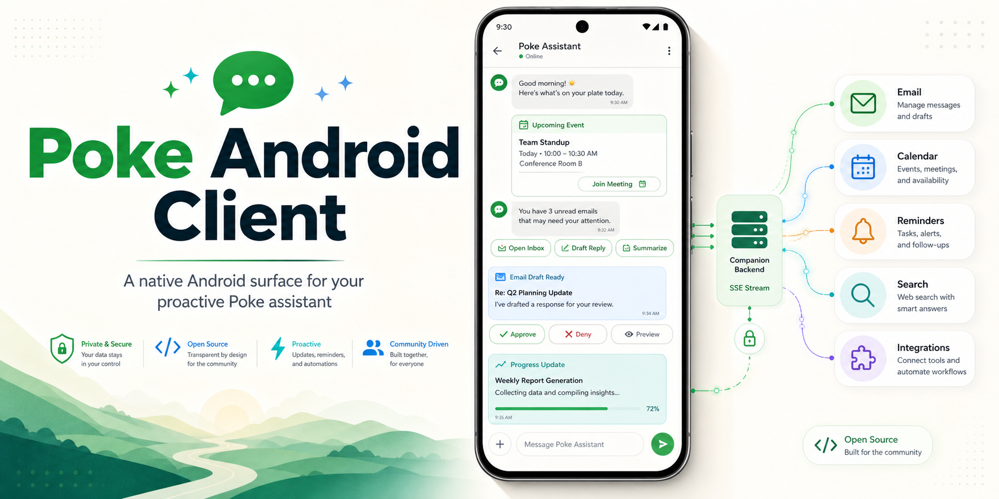

<p align="center">
  
</p>

<p align="center">
  <a href="https://github.com/luinbytes/poke-android-client/actions/workflows/ci.yml"></a>
  <a href="https://github.com/luinbytes/poke-android-client/releases"></a>
  <a href="LICENSE"></a>
  <a href="https://github.com/luinbytes/poke-android-client"></a>
  <a href="https://github.com/luinbytes/poke-android-client/issues"></a>
</p>

# Poke Android Client

Native Android client plus companion backend for Poke users who want a faster, dedicated Android path when RCS feels slower than the instant Apple Messages experience.

> This is an independent client. It is not affiliated with, endorsed by, or maintained by Poke.

## What This Is For

[Poke](https://poke.com) is a proactive AI assistant that lives in messaging channels such as Apple Messages, WhatsApp, Telegram, and RCS. People use it to manage email, calendars, reminders, web searches, automations, and connected integrations through natural conversation.

Apple Messages can make Poke feel immediate. Android RCS can be more variable. This project bridges that gap with a native Android lane for Poke:

- fast message sending from a dedicated Android composer
- reliable assistant replies, progress updates, and notifications through a companion backend
- Android-native action buttons for approvals, quick replies, links, templates, and resources
- webhook ingest into `live_data` so Poke-connected tools can query fresh external context
- always-on SSE/session handling on the backend, where long-lived connections belong

## Pieces

- `android/app`: Kotlin + Jetpack Compose APK. It can send directly to Poke's API, register with the backend, render inbound events, and handle rich actions.
- `backend`: Node 22 TypeScript service. It stores users/devices/events in SQLite, exposes Android APIs, webhook ingest, app-facing SSE, JSON-RPC helpers, and a Poke-facing SSE/message-handler scaffold.
- `docs`: setup and architecture notes.

## Quick Start

Backend:

```bash
cd backend
npm install
npm test
npm run dev
```

Android:

```bash
JAVA_HOME=/usr/lib/jvm/java-17-openjdk ./gradlew :android:app:assembleDebug
```

The debug APK is written to `android/app/build/outputs/apk/debug/`.

## Poke References

- Poke API: https://poke.com/docs/api
- Poke MCP servers: https://poke.com/docs/mcp-servers
- Poke recipes: https://poke.com/docs/creating-recipes
- Product research notes: [docs/product-research.md](docs/product-research.md)
